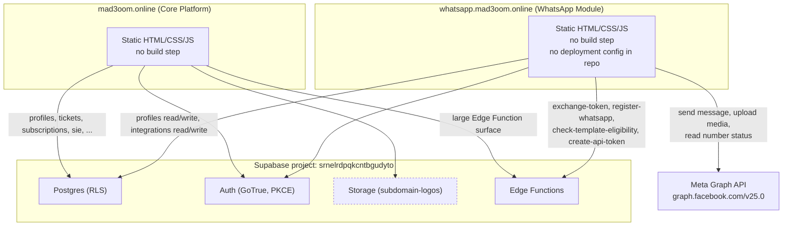
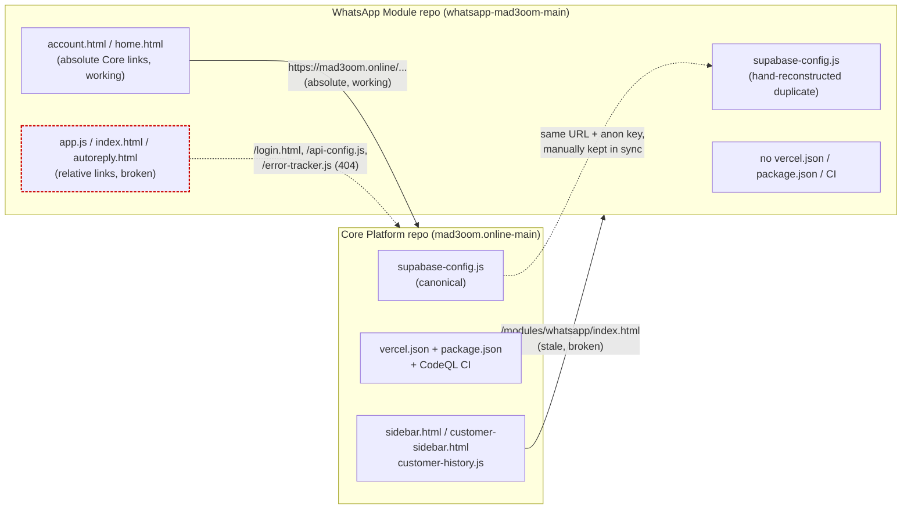
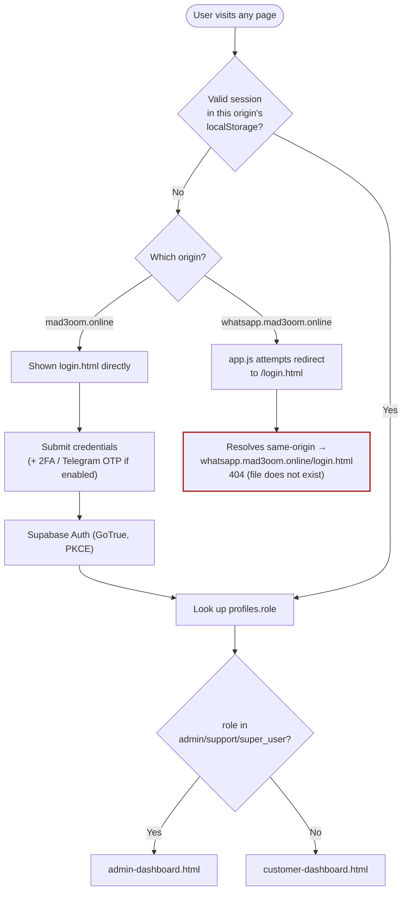
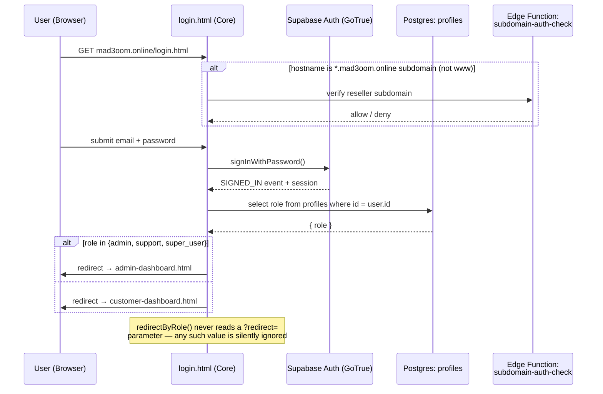
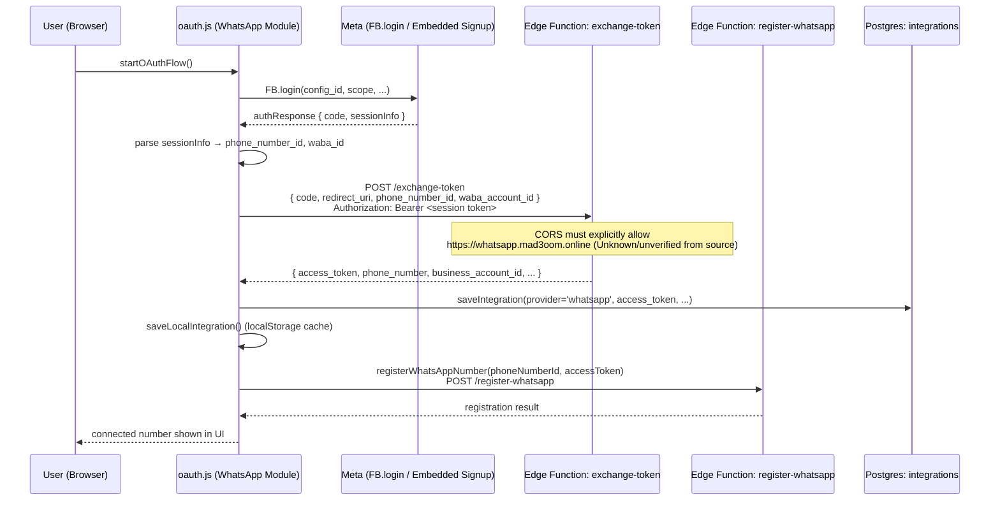
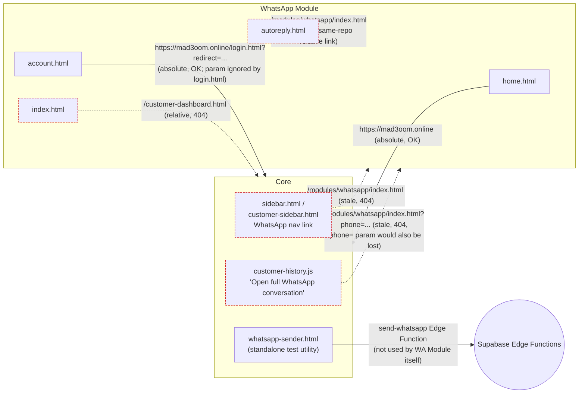
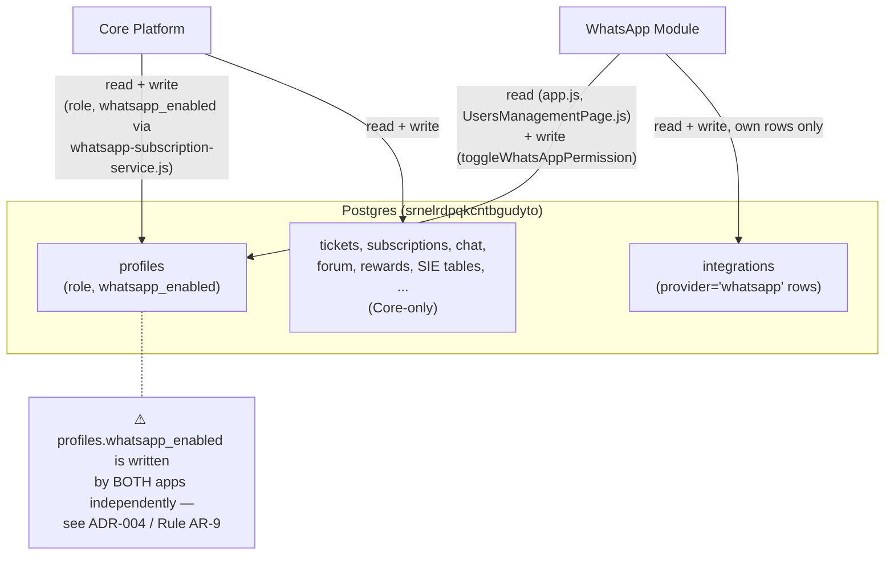
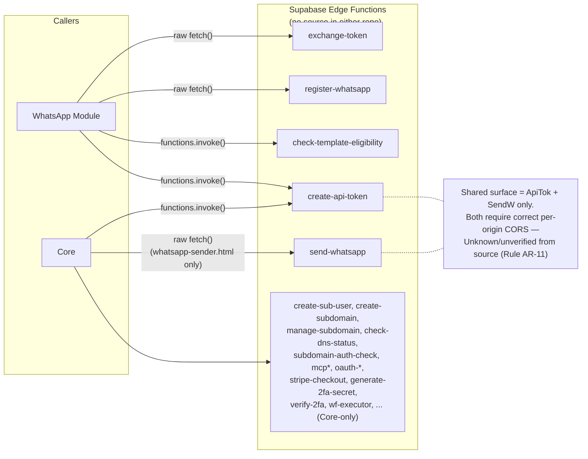
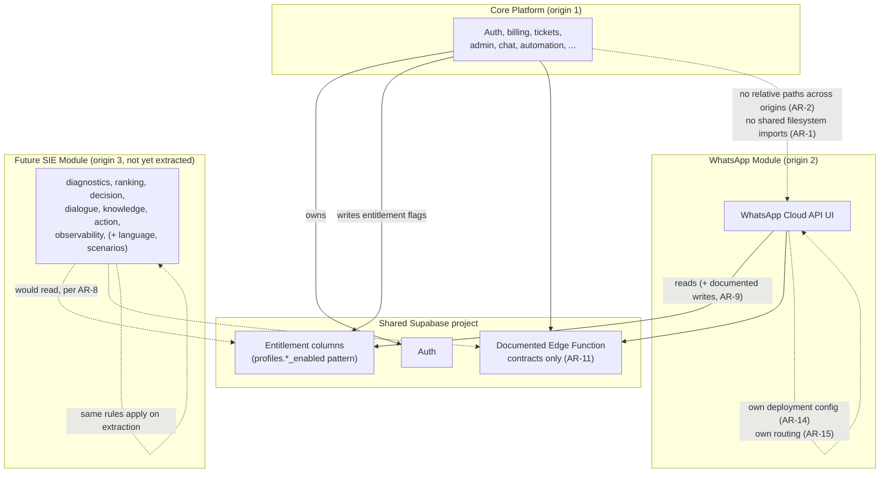

# Mad3oom Platform — Architecture Specification

**Status:** Official technical reference (consolidated)
**Scope:** Core Platform (mad3oom.online) and WhatsApp Module (whatsapp.mad3oom.online) post-repository-split, including architecture decision history, permanent engineering standards, and diagrammatic reference.

**Method:** Every statement in this document was verified directly against the source of both repositories (grep/find against the actual files), per the verification method described in Appendix A. Statements that could not be verified this way are explicitly marked **Unknown**, per convention.

**Repositories reviewed:**
- **Core Platform** — `mad3oom.online-main` (formerly `moudabdelwahab/mad3oom.online`)
- **WhatsApp Module** — `whatsapp-mad3oom-main`

**Document history:** This specification consolidates the original Architecture Documentation (v1.0), its authentication/Supabase revision (v1.2, which corrected two v1.0 findings — see Appendix B), and the Final Addendum (Architecture Decision Records, permanent Architecture Rules, and Mermaid diagrams). It supersedes all three as separate documents. No prior verified finding was altered in the course of this consolidation; only numbering, structure, and de-duplication changed. This document does not modify, refactor, or propose new code — where a code change is shown, it is only to illustrate an already-identified issue.

---

## Table of Contents

1. [System Overview](#1-system-overview)
2. [Repository Structure](#2-repository-structure)
3. [Authentication Architecture](#3-authentication-architecture)
4. [Supabase Architecture](#4-supabase-architecture)
5. [Repository Integration](#5-repository-integration)
6. [Split Impact Analysis](#6-split-impact-analysis)
7. [Required Manual Configuration](#7-required-manual-configuration)
8. [Improvement Opportunities](#8-improvement-opportunities)
9. [Future Modular Architecture](#9-future-modular-architecture)
10. [Implementation Roadmap](#10-implementation-roadmap)
11. [Architecture Decision Records (ADR)](#11-architecture-decision-records-adr)
12. [Architecture Rules (Permanent Engineering Standards)](#12-architecture-rules-permanent-engineering-standards)
13. [Architecture Diagrams (Mermaid)](#13-architecture-diagrams-mermaid)
- [Appendix A — Verification Method](#appendix-a--verification-method)
- [Appendix B — Corrections Log (v1.0 → v1.2 → Addendum)](#appendix-b--corrections-log-v10--v12--addendum)

---

## 1. System Overview

### 1.1 Overall Architecture

The platform is split across two independently deployed static front-end applications that share one Supabase backend project (`srnelrdpqkcntbgudyto`):

```
┌─────────────────────────────┐        ┌──────────────────────────────────┐
│   mad3oom.online             │        │  whatsapp.mad3oom.online         │
│   (Core Platform repo)       │        │  (WhatsApp Module repo)          │
│   Static site, Vercel        │        │  Static site, deployment target  │
│                               │        │  unverified (see 7.4)            │
└──────────────┬───────────────┘        └───────────────┬──────────────────┘
               │                                          │
               │        Both call the same project        │
               └───────────────────┬──────────────────────┘
                                    │
                     ┌──────────────▼───────────────┐
                     │  Supabase project             │
                     │  srnelrdpqkcntbgudyto         │
                     │  - Postgres (RLS)              │
                     │  - Auth                        │
                     │  - Storage                     │
                     │  - Edge Functions              │
                     └────────────────────────────────┘

               WhatsApp Module also calls Meta Graph API
               directly from the browser (not proxied through Supabase)
```

Both repositories are plain HTML/CSS/JavaScript (ES modules), loaded directly by the browser with no bundler or build step. Neither repo contains a `.env` file; all Supabase URLs and the anon (publishable) key are hardcoded as plain constants in client-side source, consistent with the fact that the anon key is meant to be public and RLS is the real access boundary. (This pattern is formalized as ADR-007 in Section 11.)

A fully diagrammed version of this architecture, along with repository, authentication, data, and Edge Function relationship diagrams, is provided in Section 13.

### 1.2 Responsibilities of Each Repository

**Core Platform (mad3oom.online)**

- Marketing/landing pages, docs, and legal pages (`index.html`, `about.html`, `developers.html`, `privacy.html`, etc.)
- Authentication: `login.html`, `forgot-password.html`, `reset-password.html`, 2FA (`2fa-verify.html`), Telegram OTP
- Customer dashboard and customer-facing tools (`customer-dashboard.html`, tickets, rewards, subscriptions)
- Admin dashboard and the full `/admin/*` suite (users, tickets, mailbox, subscriptions, settings, activity log, etc.)
- Live chat system (`chat-widget.js`, `chat-service.js`, `chat-admin.html`, `chat-customer.html`)
- Subscription and billing logic, including the WhatsApp entitlement flag (`whatsapp-subscription-service.js`)
- Subdomain reseller feature (`subdomains/`) — lets customers claim a `*.mad3oom.online` subdomain
- Automation/workflow builder (`automation/`)
- SIE ("Support Intelligence Engine" — inferred from directory contents; full name not stated in repo) — a modular chat/diagnostics engine already organized as a semi-independent subtree (`sie/`) with its own tests, README files per module, and Supabase-backed and stub data providers. Present but not yet split into its own repository (see Section 2.1 for the corrected nine-module structure, and ADR-010 in Section 11).
- MCP (Model Context Protocol) server integration (`mcp-service.js`, `/admin/mcp.html`, related Edge Function calls)
- A standalone `whatsapp-sender.html` test utility that calls the `send-whatsapp` Edge Function directly (separate from the WhatsApp Module app — see Section 4.3).

**WhatsApp Module (whatsapp.mad3oom.online)**

- WhatsApp Business Cloud API management UI: inbox, conversations, templates, campaigns, auto-reply, contacts, activity feed, developer settings, status page
- Meta Embedded Signup / OAuth flow to connect a WhatsApp Business number (`oauth.js`)
- Direct (browser-side) calls to the Meta Graph API for sending messages, uploading media, and reading number status (`services/whatsapp-api.js`) — see ADR-008 in Section 11
- Its own read/write access to the shared `integrations` table (`provider = 'whatsapp'` rows) and read **and write** access to `profiles` (corrected finding — see Section 4.2 and Appendix B)
- A public FAQ page (`whatsapp-cloud-api-faq.html`) and public `home.html` landing page

### 1.3 Shared Components

| Component | Shared how |
|---|---|
| Supabase project (`srnelrdpqkcntbgudyto`) | Same project, same URL/anon key hardcoded in both repos |
| `profiles` table | Core writes `whatsapp_enabled`/`role`; WhatsApp Module also reads **and writes** `whatsapp_enabled` (two-way write coupling — see Section 4.2, ADR-004, AR-9) |
| `integrations` table | WhatsApp Module owns this table's `provider='whatsapp'` rows entirely; Core does not read or write it anywhere in its source |
| Supabase Auth (GoTrue) | Same users/sessions at the database level, but not shared at the browser level (see Section 3) |
| `create-api-token` Edge Function | Invoked from both repos (`DeveloperSettingsPage.js` in WhatsApp Module, `mcp-service.js` in Core) |
| `send-whatsapp` Edge Function | Invoked from Core (`whatsapp-sender.html`), not from the WhatsApp Module app itself |
| Visual identity assets (`logo.png`, `logo.svg`, `error-tracker.js`) | Physically hosted only in Core; WhatsApp Module references them either by absolute URL (working) or by broken relative path (see Section 6) |

### 1.4 Independent Components

- **Deployment configuration.** Core has `vercel.json` and `package.json` in-repo. The WhatsApp Module repo has neither file — its hosting platform, build/deploy settings, and any rewrite rules are Unknown from the repository contents alone.
- **Session storage.** Each app initializes its own Supabase client and its own localStorage-backed session, scoped to its own origin.
- **UI theme systems.** Each repo has its own CSS/theme files; no shared design-token package exists.
- **Messaging.** The WhatsApp Module talks to Meta's Graph API directly from the browser using a per-user access token stored in `integrations`/localStorage; this logic does not exist in Core.
- **SIE.** Fully contained inside the Core repo today; not a separate deployable unit yet.

---

## 2. Repository Structure

This section documents the directory layout of both repositories so a future developer can orient themselves without cloning and browsing either repo first. Every directory listed below was confirmed to exist and its contents inspected; file counts and purposes are drawn from the actual files found, not inferred from naming alone.

### 2.1 Core Platform (mad3oom.online-main)

The repo root is a flat collection of ~100 top-level HTML/CSS/JS files (marketing pages, per-feature services, and legal pages) plus the directories below.

| Directory | Purpose | Responsibilities | Main entry points | Notable dependencies |
|---|---|---|---|---|
| `admin/` | The entire admin back-office UI | Ticket management (`tickets.html`), user management (`users.html`, `my-users.html`, `super-users.html`), mailbox (`mailbox.html`), subscriptions (`subscriptions.html`, `subscription-details.html`), settings (`settings.html`), activity log (`activity-log.html`), MCP admin page (`mcp.html`), automation (`automation.html`), status page (`status-page.html`), errors (`errors.html`), knowledge base admin (`knowledge-base-admin.html`), OAuth/auth consent screens (`auth-consent.html`, `oauth-consent.html`) | `dashboard.html` is the primary landing page after an admin/support/super_user login (see `redirectByRole()` in Section 3) | `admin/styles.css` (shared admin theme); most pages import feature-specific scripts from `assets/js/admin/` |
| `assets/` | Shared static assets and per-admin-page JS | `assets/components/` holds two reusable HTML fragments (`sidebar.html`, `customer-sidebar.html`) injected into other pages, each containing the (currently stale) WhatsApp nav link — see Section 6; `assets/js/` holds top-level shared scripts (`chatbot-engine.js`, `chat-logic.js`, etc.); `assets/js/admin/` holds one script per admin page; `assets/images/` holds static image assets; `assets/responsive-global.css` is a shared responsive stylesheet | Not a single-page entry point — consumed by many pages | None outside the repo itself |
| `auth/` | OAuth callback landing page | `auth/callback/index.html` — a single static page, presumably the redirect target for a third-party OAuth callback (its full purpose beyond the filename is Unknown; the page's own script logic was not required for the scope of this review) | `auth/callback/index.html` | Unknown beyond file contents not reviewed here |
| `automation/` | Visual workflow/automation builder | A self-contained drag-and-drop workflow editor: `index.html` is the entry point; `automation/js/` contains `builder-shell.js`, `canvas.js`, `node-library.js`, `inspector.js`, `side-panels.js`, `state.js`, `data-layer.js`, `workflow-list.js`, `common.js`, `main.js` — a fairly complete micro-application in its own right | `automation/index.html` | `data-layer.js` talks to Supabase directly for workflow persistence |
| `migrations/` | SQL migration files present in-repo | Contains exactly one file, `001_create_status_tables.sql`, unrelated to the WhatsApp integration; this is the only SQL present in either repository outside of `sie/` | N/A (not a runtime entry point) | Presumably applied manually or via Supabase CLI outside this repo's tooling — no migration runner script found |
| `modules/` | Two unrelated sub-projects | `modules/whatsapp/` does not exist in this repo (confirmed by `find`) — every reference to it elsewhere in the codebase is stale, pre-split debt (see Section 6). `modules/profiles/` does exist: a small, self-contained "Customer Timeline" prototype (`index.html`, `app.js`, `data.js`, `style.css`). Verified: nothing in the rest of the Core repo links to `modules/profiles/` (zero matches for the string across all HTML/JS files), and `data.js` contains no Supabase/fetch calls — this page is best treated as an orphaned or in-progress prototype, not a wired-in feature, until confirmed otherwise with the team | `modules/profiles/index.html` (unlinked) | None — appears self-contained/static |
| `sie/` | Support Intelligence Engine — a **nine**-module, semi-independent subsystem (not seven, as an earlier note stated — see Appendix B) | Each module is numbered in its own README and has its own `tests/` folder: `diagnostics/` (Module 3 — "the reasoning core"), `ranking/` (Module 4 — turns diagnostic hypotheses into a ranked list), `decision/` (Module 5 — "the most important module," picks the final action), `dialogue/` (Module 6 — presentation layer only, renders one Decision), `knowledge/` (Module 7 — completes ANSWER decisions needing real data, has a static-knowledge.data file), `action/` (Module 8 — "the sole writer," the only module permitted to write side effects, has its own `migrations/` subfolder), `observability/` (Module 9 — turns every turn's reasoning into a review/validation record, has its own `migrations/` and an `admin-ui/` subfolder). `language/` and `scenarios/` are present but, unlike the other seven modules, have no top-level `README.md` (only their `tests/` subfolders do) — their numbering/role is therefore Unknown from documentation alone, though `scenarios/scenario-catalog.data` and `language/data/` indicate their likely function (a scenario catalog and language/localization data, respectively) | Various `*.supabase.js`/`*.stub.js`/`*.local.js`/`*.provider.js` files per module (naming convention observed directly) | `sie-integration/` (sibling directory, below) wires SIE into the rest of Core |
| `sie-integration/` | The glue layer between SIE and the rest of Core | `sie-chat-bridge.js` and `sie-entitlement.js`, plus its own `README.md` | Not a page; imported by chat-facing code | Depends on `sie/` internals |
| `subdomains/` | Customer reseller subdomain feature | `create-subdomain.html`, `manage-subdomains.html` — lets a customer claim and manage a `*.mad3oom.online` subdomain, which in turn changes `login.html`'s behavior on that subdomain (see Section 3.1) | `subdomains/create-subdomain.html`, `subdomains/manage-subdomains.html` | Calls `create-subdomain`, `manage-subdomain`, `check-dns-status`, `subdomain-auth-check` Edge Functions (Section 4.3) |
| Root-level auth files | Login/session/2FA | `login.html`, `forgot-password.html`, `reset-password.html`, `2fa-verify.html`, `2fa-service.js`, `auth-client.js`, `auth-user-types.js`, `auth-validation.js`, `telegram-otp.html`, `facebook-oauth.js` | `login.html` is the single authentication entry point for the whole platform (Section 3) | `supabase-config.js`, `constants.js` |
| Root-level dashboard/service files | Customer + admin runtime logic | `customer-dashboard.html/.js`, `admin-dashboard.html`, `tickets-service.js`, `chat-service.js`, `chat-widget.js`, `notifications-service.js`, `rewards-service.js`, `subscriptions-script.js`, `whatsapp-subscription-service.js`, `mcp-service.js`, `activity-service.js`, `error-service.js`/`error-tracker.js`, `forum.js`, `robot.js` (an onboarding assistant, from `robot.css`/`onboarding-assistant.css`), `theme-manager.js`, `language-manager.js`, `ui-service.js` | Each is a focused, single-responsibility service file imported by one or more HTML pages | `customer-dashboard.html`, `admin-dashboard.html` | `supabase-config.js`, `api-config.js` |
| `.github/workflows/` | CI configuration | Present but not reviewed in depth for this document's scope — its presence confirms Core has at least some CI, unlike the WhatsApp Module repo which has none | N/A | Unknown specifics |

### 2.2 WhatsApp Module (whatsapp-mad3oom-main)

| Directory | Purpose | Responsibilities | Main entry points | Notable dependencies |
|---|---|---|---|---|
| `pages/` | One file per major screen of the WhatsApp management app | `InboxPage.js` (conversation inbox), `SendMessagePage.js`, `TemplatesPage.js`, `AutoReplyPageV2.js` ("محرر الرد الآلي المحسّن" — the enhanced auto-reply editor), `CampaignReportPage.js`, `ActivityFeedPage.js`, `DeveloperSettingsPage.js` (calls `create-api-token`), `SettingsPage.js`, `StatusPage.js`, `UsersManagementPage.js` (reads and writes `profiles.whatsapp_enabled` — see Section 4.2 correction) | Rendered into `index.html`'s app shell | `supabase-integration.js`, `services/whatsapp-api.js` |
| `components/` | Reusable UI components for the chat interface | `MessageBubble.js`, `MessageInput.js`, `ConversationList.js`, `ChatHeader.js`, `MediaPreview.js`, `AudioPlayer.js` | Consumed by `pages/InboxPage.js` and related pages | None outside repo |
| `services/` | Business/data logic separated from UI | `whatsapp-api.js` (direct Meta Graph API calls — sending, media upload, number status, and `check-template-eligibility` via `supabase.functions.invoke`), `message-store.js`, `message-scheduler.js`, `flow-analytics.js`, `whatsapp-reports.js`, `supabase-message-helper.js` | Imported by `pages/` and `app.js` | Meta Graph API (`graph.facebook.com/v25.0`), Supabase |
| `realtime/` | Live message updates | `message-realtime.js` — presumably wraps Supabase Realtime channel subscriptions; not exhaustively audited in this review (Section 4.8, "Unknown") | Imported where live inbox updates are needed | Supabase Realtime (assumed, not confirmed in depth) |
| `utils/` | Generic helpers | `dom.js`, `message-normalizer.js`, `ContactImporter.js` | Imported throughout | None outside repo |
| Root-level app files | App shell, auth, OAuth | `index.html` (main app shell/inbox), `app.js` (session guard + bootstrap — contains the three most consequential broken paths, Section 6), `oauth.js` (Meta Embedded Signup flow), `supabase-config.js`/`supabase-integration.js` (reconstructed post-split, Section 5.2), `account.html`, `home.html` (public landing page), `autoreply.html`, `whatsapp-cloud-api-faq.html` (public FAQ) | `index.html` for authenticated use, `home.html` for the public landing page | `oauth.js`, `supabase-integration.js` |
| Root-level CSS | Theming | `main.css`, `whatsapp-theme.css`, `landing-theme.css`, `icons.css`, `ui-components.css`, `flow-editor.css`/`flow-editor-v2.css`/`flow-editor-v2-improved.css`, `provisioning-status.css` | N/A | None |
| Root-level standalone utilities | `ProvisioningStatus.js`, `toast.js`, `icons.js`, `theme-manager.js`, `integration-example.js` | `integration-example.js` appears to be a reference/example file rather than a live import — its consumers were not found elsewhere in the repo during this pass and its status should be treated as Unknown/possibly dead code until confirmed | N/A | None found |

**Deployment configuration:** confirmed absent — no `vercel.json`, `package.json`, `netlify.toml`, or CI workflow directory exists anywhere in this repo. The actual hosting platform is Unknown from source (Section 1.4, Section 7.4).

---

## 3. Authentication Architecture

*(Preserved unchanged from the original review — re-verified against the same line numbers in the v1.2 pass and again during this consolidation.)*

### 3.1 Login Flow

User visits `mad3oom.online/login.html`.

`login.html` creates its own Supabase client directly in an inline `<script type="module">` block (`SUPABASE_URL`/`SUPABASE_KEY` hardcoded, identical values to `supabase-config.js`).

On successful `SIGNED_IN`, the page calls `redirectByRole(session.user.id)`, which looks up `profiles.role` and sends the browser to:

- `admin-dashboard.html` for role in `{admin, support, super_user}`, or
- `customer-dashboard.html` for everyone else.

`login.html` also has subdomain-aware logic: if `window.location.hostname` ends with `.mad3oom.online` (and isn't `www`), it treats the remainder as a customer reseller subdomain (the `subdomains/` feature) and calls the `subdomain-auth-check` Edge Function before allowing login to proceed on that subdomain.

**Verified fact — no redirect parameter support.** `login.html` never calls `URLSearchParams` and never reads a `redirect` (or similarly named) query parameter anywhere in its source. `redirectByRole()` unconditionally sends the user to one of the two dashboard pages (confirmed again in the most recent revision at `login.html:1047-1053`). Any `?redirect=...` value appended to the login URL by another page is silently ignored.

### 3.2 Logout Flow

Two independent logout implementations exist:

- **Core:** logout code is spread across admin/customer UI (not centralized in one file reviewed here); it calls `supabase.auth.signOut()` against Core's own client.
- **WhatsApp Module (`index.html`):** `handleLogout()` clears `mad3oom-guest-session`, removes any localStorage key containing `supabase.auth.token` or `sb-`, calls `supabase.auth.signOut()` on its own client (imported from the non-existent `/api-config.js` — see Section 5.2), and then does `window.location.replace('/login.html')`, a relative path that resolves to `whatsapp.mad3oom.online/login.html` (does not exist in this repo).

Because sessions are per-origin, logging out on one app does not log the user out of the other app's session, and vice versa.

### 3.3 Session Lifecycle

Both `supabase-config.js`/`api-config.js` (Core) and `supabase-integration.js` (WhatsApp Module) initialize the Supabase JS client with:

```js
auth: {
  persistSession: true,
  autoRefreshToken: true,
  detectSessionInUrl: true,
  flowType: 'pkce',
  storage: window.localStorage
}
```

(WhatsApp Module's `initializeSupabase()` sets these explicitly; Core's `api-config.js` uses the client library defaults, which are the same for `persistSession`/`autoRefreshToken`/`detectSessionInUrl` — not independently verified byte-for-byte against Core's exact call site, but no divergent auth options were found in Core's `createClient(...)` call.)

Session tokens are persisted in localStorage under Supabase's own `sb-<project-ref>-auth-token` key convention. localStorage is origin-scoped by browser design.

### 3.4 Cross-Domain Behavior

`mad3oom.online` and `whatsapp.mad3oom.online` are different origins (different hosts under the same registrable domain, but a full origin match requires identical scheme + host + port). Browsers do not share localStorage, sessionStorage, or cookies (unless a cookie is explicitly set with `Domain=.mad3oom.online`) between them.

**Verified fact:** Nothing in either repository sets an auth cookie with a shared `Domain` attribute. Both apps rely exclusively on localStorage-backed sessions. Therefore:

- A user logged in on `mad3oom.online` is not automatically authenticated on `whatsapp.mad3oom.online`, and vice versa.
- A visit to `whatsapp.mad3oom.online` while unauthenticated triggers `app.js`'s session check, which fails and attempts to redirect to a same-origin `/login.html` that does not exist in the WhatsApp Module repo (404).

### 3.5 Current Limitations (Verified)

| # | Limitation | Where |
|---|---|---|
| 1 | No shared session across the two origins (by design of localStorage) | Both repos |
| 2 | `login.html` ignores any `?redirect=` parameter | `core/login.html` |
| 3 | WhatsApp Module's no-session redirect (`app.js`) and its logout redirect (`index.html`) point at a same-origin `/login.html` that doesn't exist in that repo | `whatsapp/app.js:105`, `whatsapp/index.html:780` |
| 4 | `account.html` and `home.html` in the WhatsApp Module correctly use the absolute Core URL for login/logout redirects — this is inconsistent with `app.js`/`index.html` in the same repo | `whatsapp/account.html` |
| 5 | Any `*.mad3oom.online` subdomain is treated by `login.html` as a candidate customer-reseller subdomain and checked via `subdomain-auth-check`. This logic only runs if `login.html` itself is loaded on that subdomain; the WhatsApp Module does not host `login.html`, so this does not currently fire in practice, but it is a latent coupling if `login.html` (or its logic) is ever reused/copied onto another subdomain. | `core/login.html` |

---

## 4. Supabase Architecture

*(Preserved from the original review. Section 4.2's `profiles` row is corrected as of the v1.2 pass — see the inline note and Appendix B.)*

### 4.1 Shared Project

Both repositories point at the same Supabase project:

- URL: `https://srnelrdpqkcntbgudyto.supabase.co`
- Anon/publishable key: identical string hardcoded in both `core/supabase-config.js` and `whatsapp/supabase-config.js` (confirmed value: `sb_publishable_0pvB8_xD0txjdJBkYqXMyg__jKMw71W`)

Core's `supabase-config.js` additionally validates that the URL's project ref matches `srnelrdpqkcntbgudyto` at runtime and exposes a `debugSupabaseAuthError()` helper; the WhatsApp Module's reconstructed `supabase-config.js` (see Section 5.2) omits this validation and helper, since nothing in the WhatsApp Module repo currently calls them.

### 4.2 Shared Tables (Verified by Query Usage)

| Table | Read by | Written by | Notes |
|---|---|---|---|
| `profiles` | Core (extensively); WhatsApp Module (`app.js`, `UsersManagementPage.js`) | **Both.** Core (e.g. `whatsapp-subscription-service.js` toggles `whatsapp_enabled` on subscription expiry/renewal, lines ~673 and ~812). **Correction:** the WhatsApp Module also writes this table — `pages/UsersManagementPage.js`'s `toggleWhatsAppPermission(userId, currentState)` calls `supabase.from('profiles').update({ whatsapp_enabled: !currentState }).eq('id', userId)`. An earlier pass's claim that "the WhatsApp Module never writes to `profiles` in the reviewed source" is incorrect and is corrected here; see Appendix B for the full evidence trail. | Both apps write to the same single boolean flag (`whatsapp_enabled`) via independent code paths, with no visible coordination beyond the shared table itself — this is a real (if narrow) two-way write coupling, not the one-way flow originally documented. This gap is closed going forward by Rule AR-9 in Section 12. |
| `integrations` | WhatsApp Module only | WhatsApp Module only (`provider = 'whatsapp'` rows) | Core's source has zero references to `.from('integrations')` — reconfirmed in the most recent review pass |

No other shared-table usage was found in the WhatsApp Module repo. Any other tables referenced by Core (`tickets`, `subscriptions`, `chat`, `forum`, `rewards`, SIE observability/action tables, etc.) are Core-only as far as this review of both repos' source can confirm.

### 4.3 Shared Edge Functions (Verified by Call Sites)

| Function | Called from Core | Called from WhatsApp Module |
|---|---|---|
| `exchange-token` | Not called from Core's front-end source (function itself is presumed to live in the shared Supabase project, not in either repo's source tree — see Section 4.7) | Yes, raw `fetch()` (`oauth.js`) |
| `register-whatsapp` | Not called from Core's front-end source | Yes, raw `fetch()` (`app.js`) |
| `check-template-eligibility` | Not called from Core's front-end source | Yes, `supabase.functions.invoke()` (`services/whatsapp-api.js`) |
| `create-api-token` | Yes, `mcp-service.js` | Yes, `pages/DeveloperSettingsPage.js` |
| `send-whatsapp` | Yes, raw `fetch()` (`whatsapp-sender.html`) | Not called from the WhatsApp Module app's source (the app sends messages directly via the Graph API instead — see Section 4.6) |

Core additionally calls many Edge Functions that have no counterpart in the WhatsApp Module repo (`create-sub-user`, `create-subdomain`, `manage-subdomain`, `check-dns-status`, `subdomain-auth-check`, `mcp`, `mcp-oauth-callback`, `pi-auth`, `request-subdomain`, `stripe-checkout`, `oauth-authorize-approve`, `generate-2fa-secret`, `verify-2fa`, `wf-executor`, `get-attachment-url`, `send-ticket-email`, `generate-ai-chat-reply`, `verify-otp`, `telegram-webhook`, `save-mcp-credentials`, `mcp-oauth-start`, `test-mcp-server`, `regenerate-api-token-secret`, `manage-external-integration`, `test-integration-connection`, `oauth-discovery`, `oauth-protected-resource`, `oauth-register`, `oauth-authorize`, `oauth-token`, `mcp-server-info`, `mcp-invoke-tool`). These are listed for completeness; they are not part of the Core/WhatsApp integration surface. (`oauth-discovery`, `oauth-protected-resource`, `oauth-register`, `oauth-authorize`, and `oauth-token` are additionally confirmed as the destinations of Core's `vercel.json` rewrites — see ADR-009 in Section 11. An earlier pass's Edge Function inventory omitted `oauth-register`, `oauth-authorize`, and `oauth-token`; this is corrected here — see Appendix B.)

### 4.4 Authentication (Supabase Auth / GoTrue)

Single Supabase Auth instance for the whole project. Both apps use PKCE flow. No separate auth configuration per app was found (no custom SMTP-per-app, no separate JWT secret reference, etc., in either repo's source — configuration at the Supabase project level is Unknown, since it is managed in the Supabase Dashboard, not in either repository).

### 4.5 Storage

Only Core references Supabase Storage in its source (`storage/v1/object/public/subdomain-logos` bucket, used by the subdomain-reseller feature). The WhatsApp Module repo contains no references to Supabase Storage; media sent/received via WhatsApp is handled through Meta's own media endpoints (`graph.facebook.com`), not Supabase Storage.

### 4.6 RLS Dependencies

Row Level Security policy definitions themselves are not present in either repository (no `.sql` policy files for `profiles` or `integrations` were found; the only `.sql` files in-repo belong to Core's `sie/` subtree — `sie/action/migrations/` and `sie/observability/migrations/` — plus a `migrations/001_create_status_tables.sql` file unrelated to WhatsApp). This means:

- The actual RLS rules enforced on `profiles` and `integrations` are Unknown from these repositories and must be confirmed directly in the Supabase Dashboard/CLI.
- Both apps' client-side code assumes RLS will scope `integrations` and `profiles` rows to `auth.uid()` (every query filters by `user_id`/`id` matching the session user), but this is a client-side assumption, not something verifiable from the front-end source alone. This assumption now matters slightly more than originally documented: since the WhatsApp Module can write `profiles.whatsapp_enabled` (Section 4.2), the RLS policy on `profiles` needs to correctly restrict which rows a WhatsApp Module user (likely an admin acting within that module) can update — the front-end code alone cannot confirm this restriction exists.

### 4.7 Edge Function Source Code

Neither repository contains Edge Function source code. No `supabase/functions/` directory exists in Core or the WhatsApp Module. All Edge Functions referenced in Section 4.3 are deployed and maintained outside of both repositories (presumably via the Supabase Dashboard or a separate, unreviewed repository/CLI workflow). Consequently:

The actual CORS headers returned by `exchange-token`, `register-whatsapp`, `check-template-eligibility`, `create-api-token`, and `send-whatsapp` are Unknown and cannot be verified from source. The WhatsApp Module's own code comments (`oauth.js`) explicitly flag this as something that must be checked manually (see Section 10).

### 4.8 Services Used by Each Repository

| Supabase service | Core | WhatsApp Module |
|---|---|---|
| Postgres (via `profiles`, and many Core-only tables) | Yes | Yes (`profiles`, `integrations` only) |
| Auth | Yes | Yes |
| Storage | Yes (`subdomain-logos`) | No |
| Edge Functions | Yes (large surface) | Yes (small surface — see Section 4.3) |
| Realtime | Unknown — WhatsApp Module has a `realtime/message-realtime.js` file whose contents were not required for this review's auth/integration scope; Core's use of Supabase Realtime was not exhaustively audited | — |

---

## 5. Repository Integration

### 5.1 URLs

| From | To | Where | Status |
|---|---|---|---|
| WhatsApp Module | `https://mad3oom.online/error-tracker.js` | `home.html`, `account.html` | Working (absolute URL, explicit migration comment) |
| WhatsApp Module | `/error-tracker.js` | `index.html` | Broken — resolves to `whatsapp.mad3oom.online/error-tracker.js`, 404 |
| WhatsApp Module | `https://mad3oom.online/subscriptions.html`, `https://mad3oom.online/customer-dashboard.html`, `https://mad3oom.online` | `home.html`, `account.html` | Working (absolute URLs) |
| WhatsApp Module | `/customer-dashboard.html` | `index.html:312` | Broken — resolves to `whatsapp.mad3oom.online/customer-dashboard.html`, doesn't exist in this repo |
| WhatsApp Module | `https://mad3oom.online/login.html?redirect=...` | `account.html` | Working (absolute URL) |
| WhatsApp Module | `/login.html` | `app.js:105`, `index.html:780`, `autoreply.html:1431` | Broken in all three locations |
| WhatsApp Module | `/api-config.js` | `index.html:761` | Broken — file only exists in Core |
| WhatsApp Module | `/modules/whatsapp/index.html` | `autoreply.html:1654` | Broken/stale — pre-split path; should be a same-origin link (e.g. `index.html`) since `autoreply.html` and `index.html` are both in this repo |
| Core | `/modules/whatsapp/index.html` | `assets/components/sidebar.html`, `assets/components/customer-sidebar.html`, `customer-history.js` | Broken/stale — pre-split path; should be `https://whatsapp.mad3oom.online/index.html` (with `?phone=` preserved for `customer-history.js`'s use case) |

### 5.2 Shared Files

No files are physically shared (no symlinks, no shared npm package, no git submodule). Each repo maintains its own copy of conceptually-similar files:

- `supabase-config.js` exists independently in both repos, with the WhatsApp Module's copy explicitly documented in its own header comment as a reconstruction created because the original relative import (`../../supabase-config.js`) only resolved when the module lived two directories deep inside the old Core monorepo. The reconstructed file's values were sourced from constants duplicated inline in `autoreply.html`, not verified against a live diff of the two files by the reviewer who wrote the migration comment. This review confirms the URL and anon key are in fact identical between the two repos' `supabase-config.js` files, but confirms the WhatsApp Module's copy is missing the `debugSupabaseAuthError` export and the project-ref validation logic present in Core's copy (neither is currently required by any WhatsApp Module call site).
- `error-tracker.js` exists only in Core; the WhatsApp Module has no local copy and is only correctly wired to it in two of its three HTML entry points.

### 5.3 Shared Services

See Section 4.2 (tables) and Section 4.3 (Edge Functions).

### 5.4 API Calls

- **WhatsApp Module → Meta Graph API** (`graph.facebook.com/v25.0`): direct browser calls for sending messages, uploading media, fetching phone number status. This is entirely internal to the WhatsApp Module; Core does not perform these calls in the reviewed source, except for the single standalone `whatsapp-sender.html` utility page, which instead goes through the `send-whatsapp` Edge Function rather than calling Graph directly. (See ADR-008, Section 11.)
- **WhatsApp Module → Supabase Edge Functions:** `exchange-token`, `register-whatsapp` (raw fetch), `check-template-eligibility`, `create-api-token` (SDK `functions.invoke`).
- **Core → Supabase Edge Functions:** large surface (Section 4.3), including `send-whatsapp` and `create-api-token`, which overlap with the WhatsApp Module's function usage.

### 5.5 Database Interactions

Covered in Section 4.2. The only cross-repo data coupling is:

- Core writes `profiles.whatsapp_enabled` and `profiles.role`; the WhatsApp Module reads both to decide whether to show the app UI or a "no permission" message (`app.js`) — and, per the corrected finding in Section 4.2, also writes `whatsapp_enabled` via `UsersManagementPage.js`.
- The WhatsApp Module owns all reads/writes to `integrations` rows where `provider = 'whatsapp'`; Core never touches this table.

### 5.6 Events

No shared event bus, webhook-to-webhook call, `postMessage` bridge, or `BroadcastChannel` usage was found between the two repositories. WhatsApp inbound message delivery (Meta webhook → Supabase) is not visible in either repo's front-end source; the receiving webhook endpoint is presumably an Edge Function not included in either repository (see Section 4.7).

### 5.7 Navigation

| Direction | Entry point | Mechanism |
|---|---|---|
| Core → WhatsApp Module | Sidebar "واتساب" (WhatsApp) link, shown/hidden based on `profiles.whatsapp_enabled`/subscription | `/modules/whatsapp/index.html` — stale, must be corrected to the new absolute URL |
| Core → WhatsApp Module | "Open full WhatsApp conversation" link in customer history | `/modules/whatsapp/index.html?phone=...` — stale |
| WhatsApp Module → Core | "Back to ticketing system" button, footer links, login/subscriptions links | Mostly correct absolute URLs; `index.html`'s `/customer-dashboard.html` link is the one broken exception |

---

## 6. Split Impact Analysis

### 6.1 Broken Paths (Verified)

All of the following were confirmed by direct inspection of the WhatsApp Module and Core repositories; each was cross-checked against a `find` of both repos to confirm the target file does or does not exist at that path in that repo.

| File | Line(s) | Broken reference | Why it's broken |
|---|---|---|---|
| `whatsapp/app.js` | 105 | `/login.html` | No `login.html` in the WhatsApp Module repo; resolves to `whatsapp.mad3oom.online/login.html` (404) |
| `whatsapp/index.html` | 780 | `/login.html` | Same as above (logout redirect) |
| `whatsapp/index.html` | 312 | `/customer-dashboard.html` | No `customer-dashboard.html` in the WhatsApp Module repo |
| `whatsapp/index.html` | 4 | `/error-tracker.js` | No `error-tracker.js` in the WhatsApp Module repo |
| `whatsapp/index.html` | 761 | `/api-config.js` (ES module import) | File only exists in Core; import will fail entirely, breaking the inline logout script on this page |
| `whatsapp/autoreply.html` | 1431 | `/login.html` | Same as above |
| `whatsapp/autoreply.html` | 1654 | `/modules/whatsapp/index.html` | Pre-split path; the target page (`index.html`) is actually in the same repo/origin, so this should be a relative link, not a stale absolute monorepo path |
| `core/assets/components/sidebar.html` | 123 | `/modules/whatsapp/index.html` | Pre-split path; WhatsApp Module is now a separate origin |
| `core/assets/components/customer-sidebar.html` | 129 | `/modules/whatsapp/index.html` | Same |
| `core/customer-history.js` | 418 | `/modules/whatsapp/index.html?phone=...` | Same, and the `?phone=` query parameter is currently dropped along with the fix needed |

### 6.2 Hardcoded URLs

Beyond the broken paths above, the following hardcoded absolute URLs were found and confirmed working (listed here for completeness/inventory, not as defects):

- WhatsApp Module → `https://mad3oom.online` (bare), `/subscriptions.html`, `/customer-dashboard.html`, `/login.html?redirect=...`, `/error-tracker.js`, `/logo.png`, `/logo.svg` — all in `home.html`/`account.html`
- Both repos hardcode the Supabase project URL `https://srnelrdpqkcntbgudyto.supabase.co` at multiple call sites rather than referencing it from a single constant everywhere (each app does use its own local `SUPABASE_CONFIG.url` constant consistently within itself, but `oauth.js` and `app.js` in the WhatsApp Module additionally hardcode the full function URLs as separate string literals rather than deriving them from `SUPABASE_CONFIG.url`)

### 6.3 Redirect Problems

`login.html` never reads a `redirect` query parameter (Section 3.1), so the `?redirect=...` values appended by `whatsapp/app.js` and `whatsapp/account.html` currently have no effect — a user who is bounced to login from a deep link inside either app always lands on the generic role-based dashboard, not back where they started.

The WhatsApp Module's own `/login.html` references (Section 6.1) would 404 before a user ever reaches Core's login page at all, which makes the redirect parameter's absence a secondary problem behind the primary 404s.

### 6.4 Authentication Assumptions

Both `app.js`'s session-guard and `index.html`'s auth-gated UI assume that redirecting to `/login.html` "just works" without accounting for the fact that this module is no longer served from the same origin as `login.html`. This is the single most consequential authentication assumption broken by the split.

`account.html` and `home.html` do not carry this assumption — they were already updated to use the absolute Core URL, suggesting the fix pattern is known and simply wasn't applied consistently across every file in the WhatsApp Module repo.

### 6.5 Session Assumptions

No file in either repo assumes localStorage is shared across origins. The bugs found are about redirect targets, not about incorrect assumptions of session sharing. This is a meaningful distinction: the architecture correctly treats the two apps as having independent sessions (per the original Architecture Review's "Root cause identified" note); the remaining defects are pure broken-link issues layered on top of that correct design.

### 6.6 CORS

`oauth.js`'s own code comments correctly flag that `exchange-token` (called via raw `fetch()`, not the Supabase SDK) requires the Edge Function to explicitly return `Access-Control-Allow-Origin: https://whatsapp.mad3oom.online` or the browser will block the response.

The same applies to `register-whatsapp` (also called via raw `fetch()` in `app.js`), which carries no equivalent comment but has the identical requirement.

`check-template-eligibility` and `create-api-token` are called through `supabase.functions.invoke()`, which still requires the function to return correct CORS headers for the calling origin, but the SDK does not change that requirement — it only simplifies the call syntax.

The actual CORS configuration of any of these functions cannot be verified from either repository (Section 4.7). This must be confirmed directly against the deployed functions.

### 6.7 Meta Configuration

`oauth.js` hardcodes `REDIRECT_URI: 'https://whatsapp.mad3oom.online/index.html'` and a `META_APP_ID`/`config_id` pair. The code comment correctly notes this must exactly match an entry in Meta App Dashboard → Facebook Login → Settings → "Valid OAuth Redirect URIs" and that a full manual checklist is needed (Section 7).

Nothing in either repository can confirm what is actually registered in the Meta Dashboard today — this is inherently external configuration and is marked Unknown.

### 6.8 Remaining Tight Coupling

| Coupling | Type | Assessment |
|---|---|---|
| `profiles.whatsapp_enabled` / `profiles.role` gate the WhatsApp Module UI | Data-level (shared table) | Intentional and reasonable — this is the entitlement mechanism, not accidental coupling |
| `create-api-token` and `send-whatsapp` Edge Functions are called from both repos | Service-level (shared backend function) | Acceptable if treated as a stable, versioned shared API surface; risky only if either repo starts assuming implementation details rather than a stable contract |
| Stale `/modules/whatsapp/...` paths | Path-level | Pure technical debt from the split; not an architectural coupling, just unmigrated references |
| WhatsApp Module's reconstructed `supabase-config.js` | Content-duplication | Not "coupling" in the strict sense, but any future change to Core's `supabase-config.js` will not automatically propagate to the WhatsApp Module's copy — this is the kind of silent drift the original Architecture Review document was right to flag as a design decision to make deliberately, not accidentally |

No evidence of tight code-level coupling (no shared imports across repos, no monorepo-style relative paths that still resolve, no build-time dependency from one repo on the other) was found beyond what is listed above.

---

## 7. Required Manual Configuration

This is a checklist of configuration that lives outside both repositories and must be verified/set directly in each platform's dashboard. None of it can be confirmed or changed from the repository source; every "Unknown" here is inherent to that fact, not a gap in this review.

### 7.1 Meta Dashboard

- Confirm `https://whatsapp.mad3oom.online/index.html` is registered under Facebook Login → Settings → Valid OAuth Redirect URIs
- Confirm the previous Core-hosted redirect URI (if one existed at `mad3oom.online/modules/whatsapp/...`) is removed or intentionally left for backward compatibility
- Confirm App Domains includes `whatsapp.mad3oom.online` (and still includes `mad3oom.online` if Core uses any Meta Login features)
- Confirm the WhatsApp webhook URL points at the correct, currently-deployed Edge Function endpoint (endpoint itself not visible in either repo — see Section 4.7)
- Re-verify Embedded Signup configuration (`config_id: '2268694463535485'` in `oauth.js`) still matches what's configured in the Meta App Dashboard

### 7.2 Supabase

- Confirm CORS/allowed-origins configuration for `exchange-token`, `register-whatsapp`, `check-template-eligibility`, and `create-api-token` includes both `https://mad3oom.online` and `https://whatsapp.mad3oom.online` as appropriate per function
- Confirm RLS policies on `profiles` and `integrations` (not present in either repo) correctly scope rows to `auth.uid()`
- Confirm Auth redirect URLs / allowed redirect URLs in Supabase Auth settings include both origins if either app uses Supabase-hosted auth redirects (e.g., password reset, magic link) that land on a specific origin
- Confirm `send-whatsapp` and `create-api-token` are intentionally meant to be called from both repos, or document that this is expected

### 7.3 DNS

- Confirm `whatsapp.mad3oom.online` DNS record points at its intended hosting target (target platform unverified — see Section 7.4)
- Confirm no leftover DNS/CNAME entries reference an old path-based routing scheme

### 7.4 Vercel (or actual hosting platform)

- Confirm which platform actually hosts the WhatsApp Module — Unknown from the repository (no `vercel.json`, no `package.json`, no CI config present)
- If hosted on Vercel, confirm a `vercel.json` (or dashboard-configured rewrites) exists for the WhatsApp Module project, mirroring Core's rewrite pattern only if actually needed (the WhatsApp Module currently has no rewrite requirements found in its source)
- Confirm Core's `vercel.json` rewrites (`/.well-known/...`, `/oauth/...`, `/mcp`) are unaffected by the split — verified in this review to contain no references to the old `/modules/whatsapp/` path (see ADR-009, Section 11, for the full rewrite-to-function mapping)

### 7.5 Environment Variables

Neither repo uses build-time environment variables today (verified: no `.env` files, no `import.meta.env`/`process.env` usage in either repo). If a future change introduces env-based config, ensure both repos' hosting platforms are configured independently — there is no shared environment today.

### 7.6 OAuth

- Reconcile `META_APP_ID`/`config_id` in `whatsapp/oauth.js` against the live Meta app configuration
- Confirm Supabase Auth OAuth provider settings (if any third-party login providers are enabled) are consistent for both origins

### 7.7 CORS

- For every Edge Function called from `whatsapp.mad3oom.online` (`exchange-token`, `register-whatsapp`, `check-template-eligibility`, `create-api-token`), confirm the function's CORS response explicitly allows that origin
- For every Edge Function called from `mad3oom.online` that is also called from the WhatsApp Module (`create-api-token`), confirm both origins are allowed
- Do not change Edge Function logic to fix CORS — this is configuration (allowed-origins list), not application logic, per the original Architecture Review's instruction to leave function logic untouched

---

## 8. Improvement Opportunities

These are optional, forward-looking suggestions, kept strictly separate from the mandatory fixes in Section 10. None of these are required for the split to function correctly.

- **Single source of truth for Supabase config.** Rather than maintaining two independently-hand-written copies of `supabase-config.js`, consider publishing it (and any other genuinely shared, non-secret constants) as a small versioned package or a fetched JSON config, so future changes to the anon key or project ref don't require manually editing two repositories in sync.
- **Central "cross-app navigation" constants file.** A single exported object like `{ CORE_URL, WHATSAPP_URL, LOGIN_URL, CUSTOMER_DASHBOARD_URL }` per repo would make the next inevitable domain change (or the SIE split) a one-line edit instead of a repo-wide grep.
- **`redirect` parameter support in `login.html`.** If deep-linking back into either app after login is a real product requirement (the presence of `?redirect=` in both `app.js` and `account.html` suggests it was intended), implementing `URLSearchParams` handling in `redirectByRole()` would make that existing intent actually work.
- **Shared Edge Function contract documentation.** Since `create-api-token` and `send-whatsapp` are already called from both repos, documenting their request/response contract in one place (e.g., in this document or a dedicated `API_CONTRACTS.md`) would reduce the risk of one repo's assumptions silently breaking when the other repo's usage changes. (Now formalized as Rule AR-11/AR-18 in Section 12.)
- **Automated broken-link check.** A simple CI script that greps for `/modules/whatsapp/`, unqualified `/login.html`, and other cross-origin-relative patterns could catch this entire class of bug before merge, in either repo. (See also AR-19 in Section 12, and Section 12's provenance-drift check under AR-3.)
- **Consider whether SSO is actually needed.** Per the original Architecture Review's explicit recommendation, this document deliberately does not propose a cookie-based or token-passing SSO implementation. That remains a product decision to make only after the current broken-link issues are fixed and the team has decided whether cross-app SSO is worth the added coupling, especially with SIE's extraction still pending. (Formally recorded as deferred in ADR-003 and ADR-006, Section 11.)

---

## 9. Future Modular Architecture

The Core repository already contains a fully-formed, semi-independent module (`sie/`) organized as a set of sibling directories (`action/`, `decision/`, `diagnostics/`, `dialogue/`, `knowledge/`, `language/`, `observability/`), each with its own `README.md`, its own `tests/` folder, and — notably — a consistent naming convention that separates provider implementations (`*.supabase.js`, `*.stub.js`, `*.local.js`, `*.provider.js`) from core logic. This structure is a strong indicator of how the team already thinks about eventual extraction, even though SIE has not been split out yet (see ADR-010, Section 11).

Based on what actually happened during the WhatsApp Module's extraction (both what worked and what broke), the following principles are proposed for every future module extraction (SIE or otherwise). **These principles have since been formalized as enforceable, normative standards in Section 12 (Architecture Rules AR-1 through AR-19); the list below is retained as the original rationale and forward-looking proposal from which those rules were derived.**

1. **No relative parent-directory imports across the extraction boundary.** The single biggest source of breakage in the WhatsApp split was code written assuming a shared filesystem root (`../../supabase-config.js`). Any file that will eventually live in its own repo should already import shared config through a mechanism that survives being moved — e.g. a local copy with a clear provenance comment (as was done, imperfectly, here) or a fetched/published shared config.
2. **Every cross-app link must be absolute and centrally defined.** Relative links (`/login.html`, `/customer-dashboard.html`) are the second-largest source of breakage. A future module should reference other modules' pages only through a small, explicit constants object, never through a bare relative path.
3. **Entitlement/gating stays in shared data, not shared code.** The `profiles.whatsapp_enabled` pattern — Core writes the flag, the module reads it — is a good model to repeat. It keeps business logic (who gets access) in one place while letting each module independently decide what to do with that fact. *(Note: as corrected in Section 4.2, this flag is in practice written by both modules, not read-only by the WhatsApp Module as originally assumed here — see AR-9 in Section 12 for the standard that closes this gap.)*
4. **Shared Edge Functions are a contract, not an implementation detail.** `create-api-token` already works this way. Any function intended to be called from more than one module should be documented as a stable contract (inputs/outputs, required CORS origins) rather than something either repo can silently assume the internals of.
5. **Each module owns its own tables (or clearly-scoped rows within a shared table).** The WhatsApp Module's exclusive ownership of `integrations` rows (filtered by `provider`) is a workable pattern for modules that need their own data without a full schema split. A future module should either get genuinely new tables or a similarly-scoped provider/module-style discriminator column — never open read/write access to another module's tables.
6. **Deployment configuration travels with the code.** The WhatsApp Module repo's missing `vercel.json`/`package.json` means its deployment setup is currently undocumented anywhere in version control. Every future extracted module should include its deployment config in-repo from day one, even if minimal.
7. **A minimal "migration TODO" comment convention is worth keeping.** The WhatsApp Module's `TODO(migration):` comments in `supabase-config.js`, `supabase-integration.js`, and `oauth.js` are genuinely useful — they're the reason several of the findings in this document were possible to trace and explain. Future extractions should keep writing these, and should follow up on them rather than letting them stand indefinitely (three of them, in this case, describe problems that are still unresolved).
8. **No implicit trust that "it used to work" still applies.** Every reference that crossed the old monorepo's directory boundary needs to be treated as guilty until verified after extraction — not just paths, but shared functions, shared tables, and shared Meta/OAuth configuration.

This document does not prescribe when SIE (or anything else) should be extracted — that remains a product/engineering decision. It only defines the principles the extraction should follow when it happens.

---

## 10. Implementation Roadmap

Fixes and improvements are kept in separate tracks per the instructions in Section 8. This section covers mandatory fixes only (Track A) plus explicit sequencing guidance; Track B (optional improvements) is Section 8 and is not re-prioritized here as "roadmap" work.

### Track A — Mandatory Fixes

| Priority | Item | Risk of fixing | Risk of not fixing |
|---|---|---|---|
| **P0 — Fix first** | Correct the three broken `/login.html` references in the WhatsApp Module (`app.js:105`, `index.html:780`, `autoreply.html:1431`) to the absolute Core URL, matching the pattern already used correctly in `account.html` | Low — same pattern already proven working elsewhere in the same repo | High — currently breaks the entire unauthenticated-session flow and logout flow on the primary app entry point |
| **P0 — Fix first** | Fix `index.html`'s `/api-config.js` import to either import from the correct absolute Core URL or (preferably) from the WhatsApp Module's own `supabase-integration.js`, since that file already exposes an initialized client | Low | High — currently breaks the logout script on the main dashboard page entirely (silent module-load failure) |
| **P0 — Fix first** | Fix `index.html`'s `/error-tracker.js` and `/customer-dashboard.html` references to absolute Core URLs, matching `home.html`/`account.html` | Low | Medium — error tracking silently doesn't run on the main app page; the "back to ticketing system" button 404s |
| **P1 — Fix soon** | Update the three stale `/modules/whatsapp/index.html` references in Core (`sidebar.html`, `customer-sidebar.html`, `customer-history.js`) to the absolute WhatsApp Module URL, preserving the `?phone=` parameter in `customer-history.js` | Low | Medium — the primary in-app navigation entry point from Core into the WhatsApp Module is broken for every entitled user |
| **P1 — Fix soon** | Update `autoreply.html`'s internal `/modules/whatsapp/index.html` link to a same-repo relative link | Low | Low-Medium — only affects users with zero connected numbers viewing this specific empty state |
| **P1 — Fix soon** | Verify and, if needed, correct CORS allowed-origins on `exchange-token`, `register-whatsapp`, `check-template-eligibility`, and `create-api-token` for `https://whatsapp.mad3oom.online` | Low (config only, no logic change) | High if misconfigured — the entire Meta OAuth connect flow and number registration flow silently fail in the browser with a CORS error that's easy to misdiagnose as a Meta-side problem |
| **P2 — Can wait** | Decide whether `login.html` should support a `redirect` parameter, and implement it only if there is a real product need | Medium — touches a shared, business-critical file (`login.html`) used by every user on the platform, not just WhatsApp-related traffic | Low — the current behavior (always land on role dashboard) is a UX inconvenience, not a broken flow |
| **P2 — Can wait** | Reconcile the WhatsApp Module's reconstructed `supabase-config.js` against Core's original, deciding deliberately whether to keep it minimal (current state) or bring back the omitted validation/debug helper | Low | Low — nothing currently depends on the missing exports |
| **P3 — Optional / verify only** | Confirm Meta App Dashboard redirect URIs, App Domains, and webhook URL match what's in code | N/A (verification, not a code change) | Medium — if stale, breaks the OAuth connect flow, but this is an external config drift risk independent of the repo split itself |
| **P3 — Optional / verify only** | Confirm WhatsApp Module's actual hosting platform and add matching deployment config (`vercel.json`/equivalent) to its repo | Low | Low — currently works (the app is presumably deployed successfully somewhere), this is a documentation/reproducibility gap, not a live break |

### Sequencing Rationale

- **P0** items first because they break the authentication/session flow on the WhatsApp Module's own main page for every user — this is the highest-traffic, highest-impact surface identified in the review.
- **P1** items next because they break the cross-repo navigation that the split was explicitly designed to support, and because a CORS misconfiguration on the OAuth exchange function would block the core "connect your WhatsApp number" flow entirely.
- **P2** items are real but lower-impact — they're either cosmetic (redirect UX) or currently inert (unused exports).
- **P3** items are external-configuration verification steps that carry real risk if wrong, but are not something this review can confirm or fix from source — they require direct access to the Meta and hosting dashboards.

No item in Track A requires changing Edge Function logic, database schema, or RLS policy — consistent with the original Architecture Review's instruction to keep the Supabase backend unchanged during this phase.

---

## 11. Architecture Decision Records (ADR)

Each ADR documents a decision that is already reflected in the shipped state of both repositories. These are historical/current-state records, not proposals — where a decision is incomplete or inconsistently applied, this is captured under Consequences and Status rather than omitted.

### ADR-001 — Shared Supabase Backend Project Across Both Repositories

**Decision:** Core and the WhatsApp Module connect to the same Supabase project (`srnelrdpqkcntbgudyto`) rather than each having its own backend project.

**Context:** Both repos hardcode the identical project URL (`https://srnelrdpqkcntbgudyto.supabase.co`) and anon key (`sb_publishable_0pvB8_xD0txjdJBkYqXMyg__jKMw71W`) in their respective `supabase-config.js`. The platform was originally one monorepo; only the front-end was split.

**Motivation:** A single identity and entitlement store is required so that `profiles.role` and `profiles.whatsapp_enabled` are enforced consistently across both apps without a synchronization layer.

**Alternatives Considered:**
- Separate Supabase project per module, with users/entitlements synced by webhook or scheduled job — would add latency and consistency risk; not adopted.
- A dedicated identity/entitlement microservice fronting two independent backends — no evidence this was evaluated; listed as the standard alternative to this pattern.

**Consequences:**
- Positive: one source of truth for identity/role/entitlement; RLS enforced once, at the database layer.
- Negative: an RLS or CORS misconfiguration on a shared Edge Function affects both apps simultaneously; a compromised anon key affects both apps identically; every schema change must be coordinated across two independently-deployed codebases.

**Status:** Accepted — Implemented.

### ADR-002 — WhatsApp Management UI Extracted into an Independent Repository and Origin

**Decision:** The WhatsApp Business Cloud API management interface was extracted from the Core monorepo (formerly served at `modules/whatsapp/`) into its own repository, deployed at its own origin (`whatsapp.mad3oom.online`).

**Context:** `modules/whatsapp/` does not exist in the current Core repository (confirmed by direct search). The WhatsApp Module's own source carries explicit `TODO(migration)` comments (`supabase-config.js`, `oauth.js`) describing the prior monorepo layout and why certain imports/paths no longer resolve.

**Motivation:** Inferred from the resulting architecture — independent deployment and iteration of the WhatsApp module, decoupled from Core's release cycle.

**Alternatives Considered:**
- Keep WhatsApp as a path-based module within the Core deployment (the prior state) — abandoned; evidenced by the split itself.
- Extract as an embeddable widget/npm package rather than a fully separate origin — no evidence this was considered.

**Consequences:**
- Positive: independent deploy cadence and a smaller, more focused codebase per repo.
- Negative: every reference written under the same-origin assumption became a defect after the split — three broken `/login.html` references, one broken `/api-config.js` import, one broken `/error-tracker.js` reference, one broken `/customer-dashboard.html` reference in the WhatsApp Module, plus three stale `/modules/whatsapp/...` references left behind in Core. The extraction was not accompanied by a systematic cross-module link audit at the time it happened.

**Status:** Accepted — Implemented, with known unresolved defects tracked in Section 10 (Track A, P0/P1).

### ADR-003 — Authentication Centralized in a Single Core-Hosted Login Page

**Decision:** There is exactly one authentication entry point for the whole platform: `mad3oom.online/login.html`. The WhatsApp Module ships no login page of its own.

**Context:** No `login.html` exists anywhere in the WhatsApp Module repository. `account.html` and `home.html` in that repo correctly link to the absolute Core URL for sign-in, confirming this was a deliberate pattern, not an oversight, in at least those two files.

**Motivation:** Avoid duplicating credential handling, 2FA, and Telegram OTP logic in a second codebase; keep one authoritative session-issuing surface for the platform.

**Alternatives Considered:**
- A duplicate or embedded login form inside the WhatsApp Module — rejected; no such form exists in the repo.
- True SSO (shared cookie or token hand-off) between origins — explicitly deferred as a product decision in Section 8 ("Consider whether SSO is actually needed"); not implemented in either repo today.

**Consequences:**
- Positive: one codebase to secure and audit for authentication; consistent role-based redirect logic for the whole platform.
- Negative: because there is no SSO, every unauthenticated visit to the WhatsApp Module must round-trip to Core's origin — and because three of the WhatsApp Module's own redirect targets are relative (`/login.html`) rather than absolute, that round-trip currently 404s instead of completing (`app.js:105`, `index.html:780`, `autoreply.html:1431`).

**Status:** Accepted — Implemented, but currently broken at three call sites pending the P0 fix in Section 10.

### ADR-004 — Shared `profiles` Table as the Cross-Module Entitlement Mechanism

**Decision:** Both apps read `profiles.role` and `profiles.whatsapp_enabled` to gate access, rather than each app maintaining its own copy of role/entitlement data. Per the correction recorded in Section 4.2, both apps also write to this table.

**Context:** Core's `whatsapp-subscription-service.js` toggles `whatsapp_enabled` on subscription lifecycle events. The WhatsApp Module's `pages/UsersManagementPage.js` independently calls `supabase.from('profiles').update({ whatsapp_enabled: !currentState })` via `toggleWhatsAppPermission(userId, currentState)` — verified directly at the same call site identified during the correction pass.

**Motivation:** Keep "who is allowed to do what" as data rather than duplicated logic, so a single row change takes effect in both apps without a code deploy.

**Alternatives Considered:**
- A dedicated entitlements/roles table separate from `profiles`, reducing the blast radius of any future `profiles` schema change — not evidenced as considered.
- Read-only access for the WhatsApp Module (Core writes, module only reads) — this was the originally documented model until the correction; the actual code shows a two-way write, not a one-way flow.

**Consequences:**
- Positive: entitlement changes propagate instantly across both apps.
- Negative: this is a genuine two-way write coupling on a single boolean column, with no visible coordination between the two independent code paths beyond the shared table itself. Two admins toggling the same user's access from Core and the WhatsApp Module in close succession is a real (if narrow) race condition whose outcome depends entirely on RLS/database-level behavior, which is Unknown from source. This is a materially tighter coupling than the one-way "Core writes, module reads" pattern that Section 9's forward-looking principles originally assumed.

**Status:** Accepted — Implemented, with the write-coupling risk not previously carried into the Section 10 roadmap. Addressed going forward by Rule AR-9 in Section 12.

### ADR-005 — Shared, Cross-Repo-Callable Edge Functions as the Only Backend Contract Surface

**Decision:** `create-api-token` and `send-whatsapp` are the only two Edge Functions called from more than one repository; every other Edge Function is scoped to a single caller. Neither repository contains Edge Function source — both treat these functions purely as an external, deployed contract.

**Context:** `mcp-service.js` (Core) and `pages/DeveloperSettingsPage.js` (WhatsApp Module) both call `create-api-token`. `whatsapp-sender.html` (Core) calls `send-whatsapp`; the WhatsApp Module's own app does not call it, sending messages via the Meta Graph API directly instead (see ADR-008).

**Motivation:** Reuse one centrally-deployed implementation rather than duplicating token-issuance logic across two codebases.

**Alternatives Considered:**
- Each repo implements its own token-issuance logic — would duplicate business logic and secret handling.
- A shared internal code package for function logic — not applicable, since Edge Functions live outside both repos' source trees entirely.

**Consequences:**
- Positive: a single implementation to maintain and secure for these two functions.
- Negative: CORS configuration for both functions must explicitly allow both origins; this cannot be verified from either repository and is called out as a P1 risk in Section 10, because a misconfiguration silently breaks the flow in a way that's easy to misdiagnose as Meta-side.

**Status:** Accepted — Implemented; CORS correctness Unknown/unverified from source pending the Section 7 checklist.

### ADR-006 — No Cross-Origin Session Sharing (Independent, Origin-Scoped Auth Sessions)

**Decision:** Each app initializes its own Supabase client and stores its session under its own origin's localStorage. No shared-domain cookie or token hand-off exists between `mad3oom.online` and `whatsapp.mad3oom.online`.

**Context:** Neither repository sets a cookie with `Domain=.mad3oom.online`; both rely exclusively on localStorage-backed PKCE sessions (unchanged since the original review, re-verified in the correction pass and again in this consolidation).

**Motivation:** Avoids the complexity of a shared-cookie or token-relay SSO scheme across two independently deployed origins.

**Alternatives Considered:**
- A shared-domain cookie for single sign-on across both origins.
- Token hand-off via redirect — the `?redirect=` query parameters already present in the WhatsApp Module's broken links (`app.js`, `account.html`) suggest this kind of flow was anticipated; `login.html` never reads any such parameter, so it was never completed.

**Consequences:**
- Positive: no shared-cookie security surface to manage; logging out of one app cannot accidentally end the other app's session.
- Negative: a user must authenticate twice (once per origin); the deep-link-back-after-login UX implied by the unused `?redirect=` parameters does not function anywhere in the platform today.

**Status:** Accepted — Implemented by omission. Whether to introduce SSO remains an explicitly deferred product decision (Section 8/9).

### ADR-007 — No Build Step; Plain ES Modules with Hardcoded, Public Configuration

**Decision:** Both repositories ship plain HTML/CSS/JS ES modules loaded directly by the browser, with no bundler, no build step, and no `.env`-based configuration. The Supabase URL and anon key are hardcoded as plain constants in client-side source in both repos.

**Context:** No `.env` files and no `import.meta.env`/`process.env` usage exist in either repo. Core has a `package.json` (present for tooling, not a build pipeline for the served site) and a CodeQL CI workflow; the WhatsApp Module has no `package.json`, `vercel.json`, or CI configuration at all.

**Motivation:** The anon/publishable key is designed to be public, with Row Level Security as the real access boundary, so hardcoding it client-side adds no risk beyond what build-time injection would provide.

**Alternatives Considered:**
- Build-time environment-variable injection (e.g., a bundler's `define` plugin) to avoid literal config strings in source — not adopted; would require a build pipeline neither repo currently has.

**Consequences:**
- Positive: zero build tooling to maintain; either repo can be served as-is by any static host.
- Negative: the WhatsApp Module's `supabase-config.js` is a hand-reconstructed duplicate of Core's, not a single generated artifact — any future change to the shared anon key or project ref requires manually editing two independently-maintained files in sync, with no automated check that they still match.

**Status:** Accepted — Implemented.

### ADR-008 — WhatsApp Module Calls the Meta Graph API Directly from the Browser for Messaging

**Decision:** Message sending, media upload, and phone-number-status calls from the WhatsApp Module go directly to `graph.facebook.com/v25.0` from client-side code (`services/whatsapp-api.js`), rather than being proxied through a Supabase Edge Function — even though Core's own `whatsapp-sender.html` utility proxies the same underlying action (sending a message) through the `send-whatsapp` Edge Function.

**Context:** The WhatsApp Module contains zero calls to `send-whatsapp` anywhere in its source; `whatsapp-sender.html` is a separate, standalone Core utility page, not part of the WhatsApp Module app.

**Motivation:** Inferred — direct Graph API calls avoid an extra network hop and keep the per-user Meta access token flow self-contained within the module that owns it (the token is stored in the `integrations` table, which only the WhatsApp Module reads/writes).

**Alternatives Considered:**
- Route all outbound WhatsApp messages through `send-whatsapp` uniformly, as Core's own utility already does — would give one code path, one place to enforce rate limits/logging, and would keep the Meta access token server-side rather than exposing it to the browser.

**Consequences:**
- Positive: fewer round-trips for the module's primary user action; no dependency on `send-whatsapp` being deployed/working for the module's core use case.
- Negative: the platform has two different code paths for "send a WhatsApp message" with no shared validation or logging between them; the per-user Meta access token is handled and stored client-side (`integrations` table / localStorage) rather than server-side only.

**Status:** Accepted — Implemented. Consolidating onto one send path is not currently tracked in Section 10 and would require a new decision, not a mandatory fix.

### ADR-009 — Independent Deployment Configuration Per Repository

**Decision:** Each repository is responsible for carrying its own deployment configuration, rather than a shared infra/deploy repository governing both.

**Context:** Core's `vercel.json` defines six rewrites — `/.well-known/oauth-authorization-server`, `/.well-known/oauth-protected-resource`, `/oauth/register`, `/oauth/authorize`, `/oauth/token`, and `/mcp` — all pointing at Supabase Edge Functions (`oauth-discovery`, `oauth-protected-resource`, `oauth-register`, `oauth-authorize`, `oauth-token`, `mcp` respectively), and contains no reference to the old `/modules/whatsapp/` path (reconfirmed in this review). The WhatsApp Module repository has no `vercel.json`, `package.json`, `netlify.toml`, or CI configuration of any kind.

**Motivation:** Inferred from the split itself — independent deployability is the point of separating the repos.

**Alternatives Considered:**
- A shared deployment/infrastructure repository defining both apps' hosting config in one place — not adopted; each repo is meant to be self-contained (though the WhatsApp Module currently is not, with respect to deployment).

**Consequences:**
- Positive: Core's deployment is fully reproducible from its own repository.
- Negative: the WhatsApp Module's actual hosting platform, build settings, and any rewrite rules are entirely Unknown from its repository — its deployment is not reproducible from version control alone.

**Status:** Accepted in principle; Incomplete in practice for the WhatsApp Module. Tracked as a P3 verify-only item in Section 10.

### ADR-010 — SIE Kept In-Repo, Modularized Internally But Not Yet Extracted

**Decision:** The Support Intelligence Engine (`sie/`) is organized internally as nine numbered, semi-independent modules, each with its own README and tests, and a consistent `*.supabase.js` / `*.stub.js` / `*.local.js` / `*.provider.js` provider convention — but it remains inside the Core repository and is not deployed as its own origin.

**Context:** `diagnostics/`, `ranking/`, `decision/`, `dialogue/`, `knowledge/`, `action/`, and `observability/` each carry a top-level README documenting their module number and role; `language/` and `scenarios/` exist but have no top-level README, so their exact role/numbering is Unknown from documentation alone. `sie-integration/` (`sie-chat-bridge.js`, `sie-entitlement.js`) is the glue layer wiring SIE into the rest of Core.

**Motivation:** Inferred — the internal provider-abstraction pattern (separating Supabase-backed from stub/local implementations per module) strongly suggests SIE is being deliberately prepared for an eventual extraction similar to the WhatsApp Module's, without a commitment to do so yet.

**Alternatives Considered:**
- Extract SIE into its own repository/origin now, following the WhatsApp Module's pattern.
- Leave SIE unstructured within Core — rejected in practice; the existing README/tests/provider convention shows this was deliberately avoided.

**Consequences:**
- Positive: SIE can be extracted later with comparatively low friction if the principles in Section 9 are followed, since it is already internally decoupled via the provider pattern.
- Negative: until extracted, SIE cannot be deployed, scaled, or versioned independently of the rest of Core; `language/` and `scenarios/` currently carry undocumented ambiguity about their role that should be resolved before any extraction is attempted.

**Status:** Deferred / Not Yet Implemented. This ADR records the current, apparently intentional "not yet" state — there is no repository evidence that extraction is scheduled.

---

## 12. Architecture Rules (Permanent Engineering Standards)

These rules are normative (MUST / MUST NOT), not descriptive. They govern how every future module — a SIE extraction or anything else — integrates with the platform. They generalize the principles already proposed in Section 9, restated here as enforceable standards, and additionally close the specific gap identified in ADR-004 (the `profiles` two-way write) that Section 9's original principles did not anticipate.

### Category A — Repository & Code Independence

- **AR-1.** No cross-repository imports. A module MUST NOT import a file, relative or absolute, from another module's repository or from a former monorepo path. *(Observed violation this rule prevents: the WhatsApp Module's original `../../supabase-config.js` import, which only worked while both apps shared one filesystem root.)*
- **AR-2.** No filesystem-path dependencies across origins. A module MUST treat every other module as reachable only by absolute URL or documented API call — never by relative path, and never by assuming a shared directory structure. *(Observed violations this rule prevents: `/login.html`, `/api-config.js`, `/error-tracker.js`, `/customer-dashboard.html` in the WhatsApp Module; `/modules/whatsapp/index.html` in Core.)*
- **AR-3.** Shared, non-secret configuration (backend URL, anon key, project ref) MUST have one canonical source. Each module MAY keep a local copy for build-independence, but that copy MUST carry a provenance comment identifying its source of truth and MUST be checked for drift on every release of either module, per Section 8's improvement recommendation. A copy without a provenance comment is non-compliant.

### Category B — Session & Authentication

- **AR-4.** Authentication MUST remain centralized in one module (today, Core's `login.html`). No other module may implement its own credential form, its own 2FA, or its own OTP flow.
- **AR-5.** Every redirect to the authentication module MUST use that module's absolute URL. A relative `/login.html` (or equivalent) reference from any other module's origin is a defect, not a stylistic choice.
- **AR-6.** No module may assume a session set in another module's origin is available to it (no implicit SSO). If cross-module SSO is ever adopted, it MUST be introduced as an explicit, documented mechanism (e.g., a shared-domain cookie or a signed token hand-off) — not as an assumption baked into redirect logic.
- **AR-7.** A redirect parameter (e.g. `?redirect=`) MUST NOT be attached to a URL by a calling module unless the receiving module's documented contract states that it reads and honors that parameter. An unread parameter is dead code that misrepresents the actual behavior to the next engineer who finds it.

### Category C — Data & Entitlement Contracts

- **AR-8.** Entitlement and role data MUST live in shared data (a table/column), not shared code. Each module decides independently what to do with the fact; it must not reimplement another module's authorization logic.
- **AR-9.** If more than one module writes to the same shared entitlement column or row, that write path MUST be documented as a two-way contract (which modules write, under what user action, with what expected conflict-resolution behavior) — not left as an undocumented side effect discovered by code review. A shared column with silent multi-writer access, as found for `profiles.whatsapp_enabled` (ADR-004), is non-compliant until documented and until the RLS behavior under concurrent writes is confirmed.
- **AR-10.** Each module SHOULD own its own tables, or clearly-scoped rows within a shared table (a provider/module discriminator column, as the WhatsApp Module already does with `integrations.provider = 'whatsapp'`). A module MUST NOT be given open read/write access to another module's tables beyond an explicitly documented entitlement or ownership column.

### Category D — Backend & API Contracts

- **AR-11.** Any Edge Function (or other backend endpoint) intended to be called from more than one module's origin MUST be documented as a stable contract: request/response shape, required CORS-allowed origins, and authentication requirements. `create-api-token` and `send-whatsapp` are the reference examples; any new cross-module function must meet the same bar before a second module is allowed to call it.
- **AR-12.** A module MUST NOT assume another module's private implementation details of a shared function — only its documented input/output contract. Edge Function logic changes are the responsibility of whoever owns the function, and must not silently break a caller that never had insight into the internals.
- **AR-13.** If a shared backend action (e.g., "send a WhatsApp message") already has an established path used by one module, a new module introducing a second path to the same action (as in ADR-008) MUST document why the divergence exists and must not silently duplicate business logic, validation, or logging.

### Category E — Deployment & Routing

- **AR-14.** Every module MUST carry its own deployment configuration in its own repository from day one (build settings, rewrites, environment target) — even if minimal. A module with no deployment configuration in version control, as is currently true of the WhatsApp Module (ADR-009), is non-compliant and must have this added before being treated as a template for future extractions.
- **AR-15.** Each module owns its own routing. No module may hardcode a path that assumes it will always be served from a specific sibling path under another module's origin.
- **AR-16.** Each module owns its own UI/theme system. Shared visual identity assets (logos, error-tracking scripts) MUST be referenced by absolute URL to their single hosting location, never duplicated and never referenced by a relative path that assumes co-location.

### Category F — Documentation

- **AR-17.** Every module owns its own documentation, including its own migration/TODO-comment trail for anything not yet resolved (the WhatsApp Module's `TODO(migration):` convention in `supabase-config.js`, `supabase-integration.js`, and `oauth.js` is the reference example and should be continued, not abandoned once the module stabilizes).
- **AR-18.** Every shared contract (shared table, shared column, shared Edge Function) MUST be documented in one place readable by engineers on both sides of the contract — not solely inferable by grepping both repositories, which is how the `profiles` two-way-write coupling in ADR-004 went unrecorded until it was found.
- **AR-19.** A future module extraction MUST NOT be considered complete until an automated check (Section 8's "Improvement Opportunities" already proposes this) confirms no stale cross-repository relative paths remain in either the extracted module or the module it was extracted from.

---

## 13. Architecture Diagrams (Mermaid)

These diagrams are derived directly from the verified facts in the sections above. They are visual aids only — the authoritative statements remain the prose sections; where a diagram simplifies a nuance (e.g., "Unknown" items), the prose sections take precedence.

### 13.1 High-Level System Architecture



### 13.2 Repository Relationships



### 13.3 Authentication Flow (Overview)



### 13.4 Login Sequence



### 13.5 Logout Sequence

```mermaid
sequenceDiagram
    participant U as User (Browser)
    participant C as Core (various pages)
    participant W as WhatsApp Module: index.html
    participant A1 as Supabase Auth (Core client)
    participant A2 as Supabase Auth (WA client)

    rect rgb(235,245,235)
    Note over U,A1: Core logout
    U->>C: click logout
    C->>A1: supabase.auth.signOut()
    A1-->>C: session cleared (Core origin localStorage only)
    end

    rect rgb(250,235,235)
    Note over U,A2: WhatsApp Module logout (index.html handleLogout)
    U->>W: click logout
    W->>W: import supabase from '/api-config.js'
    Note over W: BROKEN — file only exists in Core;<br/>module import fails, script does not run
    W->>W: clear mad3oom-guest-session +<br/>any key containing supabase.auth.token / sb-
    W->>A2: supabase.auth.signOut() (if import had succeeded)
    W->>U: window.location.replace('/login.html')
    Note over W,U: BROKEN — resolves to<br/>whatsapp.mad3oom.online/login.html (404)
    end

    Note over A1,A2: Sessions are per-origin either way —<br/>logging out of one never affects the other
```

### 13.6 WhatsApp OAuth (Embedded Signup) Flow



### 13.7 Core ↔ WhatsApp Module Interaction (Navigation)



### 13.8 Supabase Table Interactions



### 13.9 Edge Function Communication



### 13.10 Future Modular Architecture (Target Pattern)



---

## Appendix A — Verification Method

Every path, table name, function name, and URL cited in this document was located by direct text search (grep/find) against the full contents of both repository sources, not inferred from filenames, comments, or prior documentation alone. Where a prior claim could not be independently confirmed this way, it is marked Unknown rather than restated as fact. This method was applied consistently across the original review, the authentication/Supabase correction pass, and the final addendum (Sections 11–13) that this specification incorporates.

Areas explicitly out of scope for this verification pass, because their implementation is not present in either repository:

- Supabase RLS policy definitions
- Edge Function source code and their live CORS configuration
- Meta App Dashboard configuration
- DNS records
- The WhatsApp Module's actual hosting platform and deployment settings
- Supabase Realtime channel configuration and usage depth

No new claims are made in this consolidation about Supabase Dashboard configuration, Meta Dashboard configuration, DNS, or Edge Function source code — these remain Unknown for the same reasons documented above and in Sections 4.7 and 7.

---

## Appendix B — Corrections Log (v1.0 → v1.2 → Addendum)

This log consolidates the corrections that were made to the original Architecture Documentation (v1.0) findings during the subsequent authentication/Supabase revision pass and the final addendum review. Each entry records what the original finding said, what the corrected finding is, and where the correction is now reflected in this specification. This is a corrections record, not a change to any code or infrastructure.

| # | Original (v1.0) finding | Corrected finding | Reflected in |
|---|---|---|---|
| 1 | `profiles` table: "WhatsApp Module never writes to `profiles` in the reviewed source" — Core was documented as the sole writer of `whatsapp_enabled`/`role`. | The WhatsApp Module also writes `profiles.whatsapp_enabled`, via `pages/UsersManagementPage.js`'s `toggleWhatsAppPermission(userId, currentState)`, which calls `supabase.from('profiles').update({ whatsapp_enabled: !currentState }).eq('id', userId)`. This is a genuine two-way write coupling on a single boolean column, not a one-way flow. | Section 4.2; ADR-004 (Section 11); Rule AR-9 (Section 12); Section 13.8 diagram |
| 2 | SIE (`sie/`) was described as a seven-module subsystem. | SIE is a **nine**-module subsystem: the seven modules with top-level READMEs (`diagnostics`, `ranking`, `decision`, `dialogue`, `knowledge`, `action`, `observability`) plus `language/` and `scenarios/`, which exist but carry no top-level README and whose exact role/numbering remains Unknown from documentation alone. | Section 2.1; ADR-010 (Section 11) |
| 3 | The inventory of Core-only Edge Functions omitted `oauth-register`, `oauth-authorize`, and `oauth-token`. | These three functions are confirmed present and are additionally confirmed as the destinations of three of Core's six `vercel.json` rewrites, alongside `oauth-discovery`, `oauth-protected-resource`, and `mcp`. | Section 4.3; ADR-009 (Section 11) |

No other findings from the original review, the correction pass, or the final addendum were altered in producing this consolidated specification — only structure, numbering, and de-duplication changed.
---

*End of specification. This document is the complete, current architectural reference for the Mad3oom Platform, superseding all prior separate versions and the standalone Final Addendum.*
